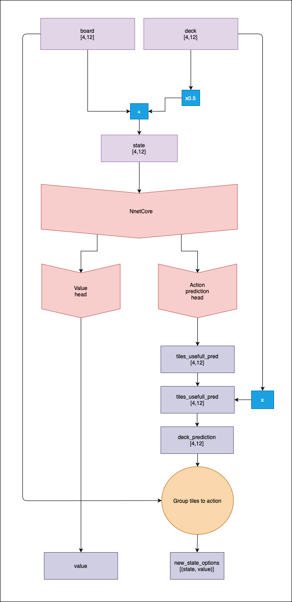
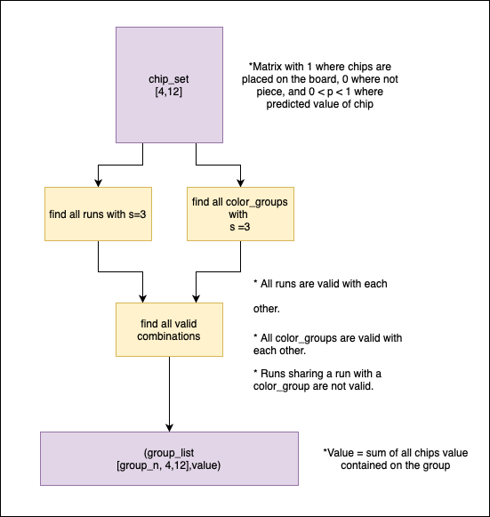

# alpha-zero-java
Java immplementation of apha-zero to play rummikub.

**

 - **Algorithm v0:**
	 - **Input:** 
			 - actual board, as a matrix of 1 and 0, where there is a chip.
			 - actual player deck, as a matrix of 1 and 0, where there is a chip.

	   			
	 - **Output**: 	
			 - With head one, the probability of winning from the actual
	   state. 
			 - Head two + Grouping, the probability of winning for every    posible
	   action.
			 - 

 - **The grouping problem:**
	 - From a set of [4,12] chips, get the valid agrupation with the biggest score possible.
	 - 

 - **Dataset generation:** 	
	 - Playing random games and back propagating 1 if
   winning, generating a dataset composed by (state,v).

 - **Initial training:**
	 - First head will be trained directly on the    dataset.
	 - Second head can be trained by transfer-learning from the    first
	   one, also, can be trained with the actions taken by previous winner
	   agents.

**
