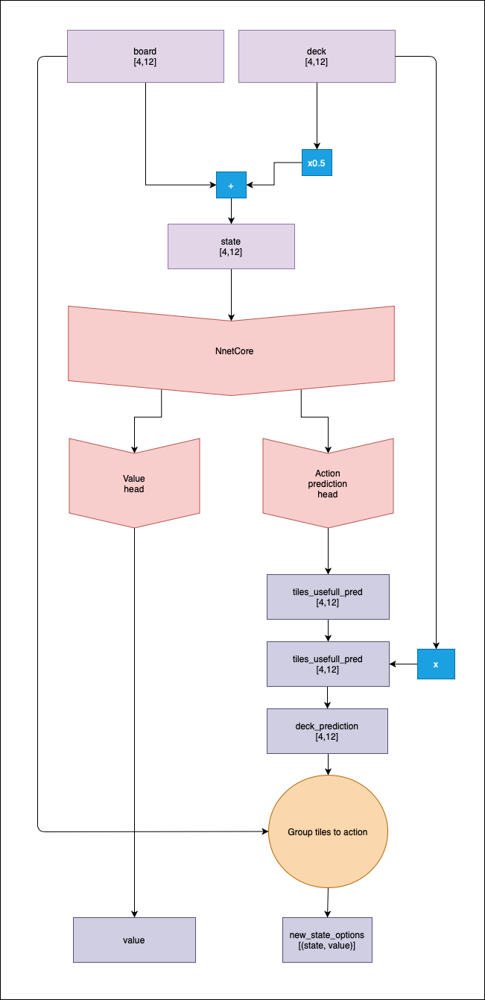
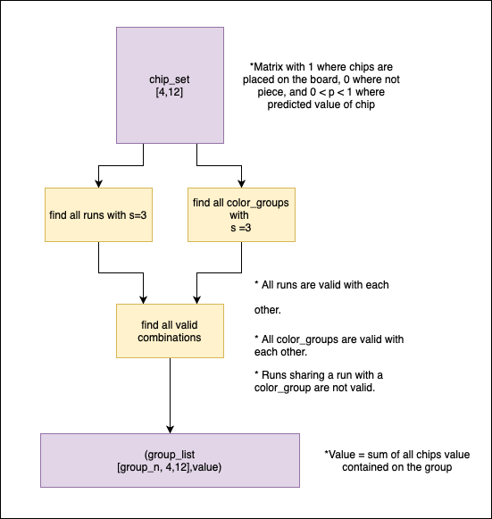
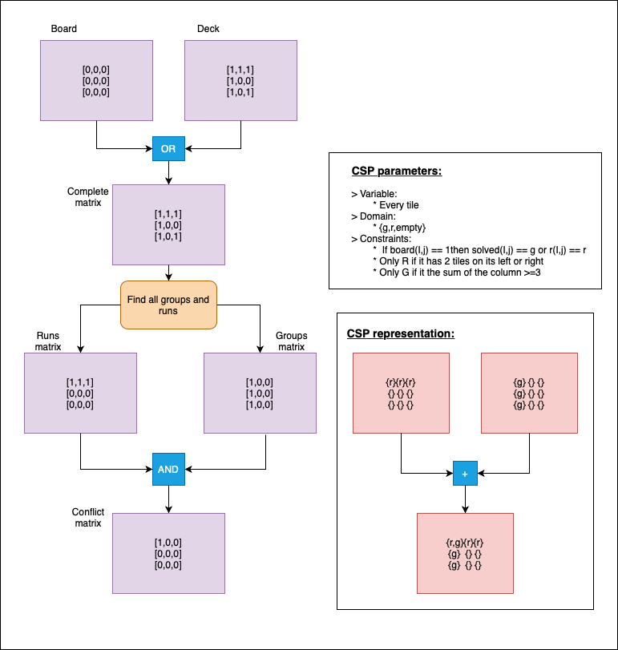
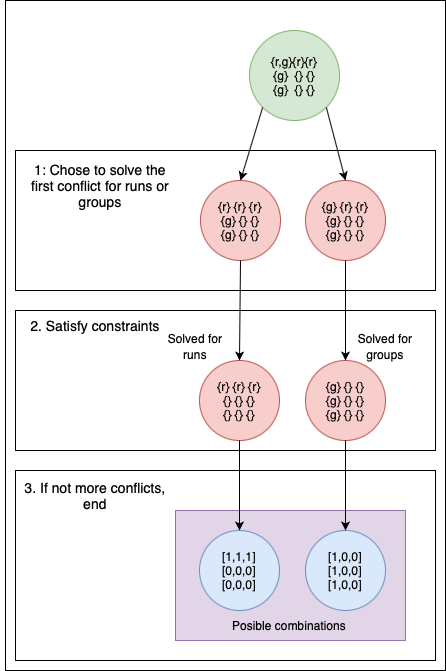
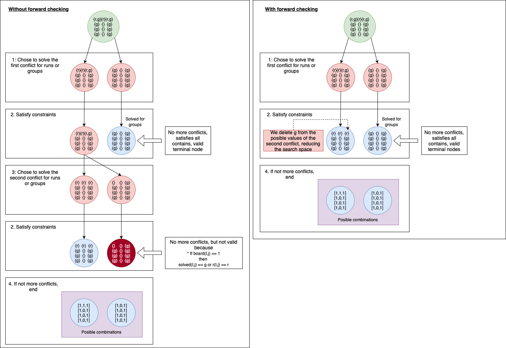

# alpha-zero-java
Java immplementation of apha-zero to play rummikub.

 - [**Google Colab**](https://colab.research.google.com/drive/1uaCN-p7BUJ9gNmrxUrwxkhLZhgKvA4kH?usp=sharing)

 - **Algorithm v0:**
	 - **Input:** 
			 - Actual board, as a matrix of 1 and 0, where there is a chip.
			 - Actual player deck, as a matrix of 1 and 0, where there is a chip.

	   			
	 - **Output**: 	
			 - With head one, the probability of winning from the actual
	   state. 
			 - Head two + Grouping, the probability of winning for every posible action.

 - **The grouping problem:**
	 - From a set of [4,12] chips, get the valid agrupation with the biggest score possible.
	
	 - **First approach:**
		 - This method was discarded cause the big computational resources needed to get all possible combinations of all runs and groups, making it really inefficient.
	 - **Second approach:**
		 - **CSP** (Constraint satisfaction problems) with backpropagation.
		 - We can see this grouping problem as a constraint satisfaction, where we have to chose to play some runs or groups, based on its restrictions, this means, that we gonna check only those tiles that represent a conflict (a tile that can form either a run or a group, but not both).
		 
		 - Example, imagine an empty table and a deck **{{1,black},{2,black},{3,black},{1,orange},{1,blue},{3,blue}}**, this means you can form a run or a group in the table, but how do we find that? We check conflict by conflict, solving the restrictions and removing invalid new states:
		 
		 - Problems and improvements:
			 - Applying forward checking:
				 - There are cases where conflicts are inter-dependent, this means that solving a conflict, can solve other conflicts. In our first approach, we will check each initial conflict, even if they are already solved by the selections done throw the tree.
				 - Example, imagine having on the table **{{1,black},{1,red},{1,orange},{1, blue},{3,black},{3,red},{3,orange},{3, blue}}** and a deck with {{2,black}}, so we have 2 color groups on the table, and we can form one run.
				 
		 - **CSOP** (Constraint satisfaction optimization problems).
		 - CSP give us all the possible solutions to our problem, but, having an heuristic allow us to solve it with an informed algorithm, with better search methods.  
		-   CSOP tries to get the maximize/minimize the value of the terminal nodes, looking for the one with the biggest value.
		-   Remember the output of our net, it tell us a score for each tile, so the sum of all tiles in our solution is the value.
		-   We calculate, for each conflict decision, the points lost by that decision, so if it removes a tile, that score is lost, the value of the terminal node, is the max value that can be obtained minus all the points lost by decision making, the maximum value a branch can get from a conflict Cn, is the maximum value minus all the points lost in the previous solved conflicts.
		-   We prune all branches with max possible value (maxValue-lostPoints) minor than the biggest terminal value found.
		-   {TODO : Example GRAPH}
	- {TODO: Results}

- **Initial training:**
	 - Playing random games and back propagating 1 if
   winning, generating a dataset composed by (state,v).
	 - First head will be trained directly on the    dataset.
	 - Second head can be trained by transfer-learning from the    first
	   one, also, can be trained with the actions taken by previous winner
	   agents.
- **Final training:**
	-   To train our neural network, we need to improve the values that the net gives to our tiles toward better game results, that means, that we need to get, for a state S, a policy vector P(S), that contains an array with the score of playing different actions (tile combinations).
	-   Getting P(S) involves modifying our grouping algorithm, that was developed with an exploitation use in mind, but learning from self play, involves exploration to check if actions with low scores (erroneous predictions of our net during training), can lead to good game results. This means adding a threshold to our CSOP branch prune, so we can get suboptimal combinations, and storing the different combinations along with their score. P(S) will contain only the score of each calculated combination that can be explored.
	-   Coming back from a modified P(S) to the tile score matrix:
		- The value of each P(S,a) represent the sum of all tiles used in the next state given by an action, so modifying the value of a combination will lead to modify the value of some tiles, without modifying other P(S,a).
		.png)
	- {TODO: Updating P(S)}
	- Simplified example of MTCS over one node, updating score matrix based on the new P(S) policy vector:

